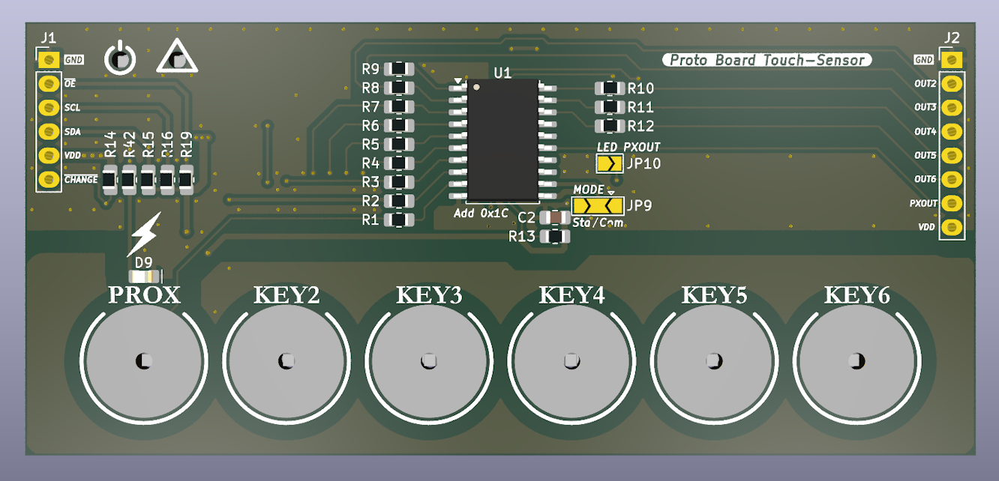
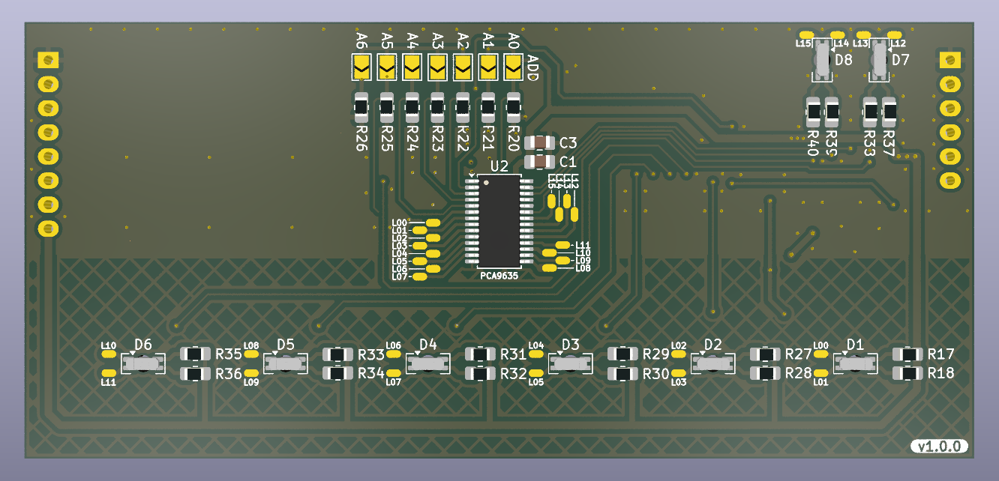
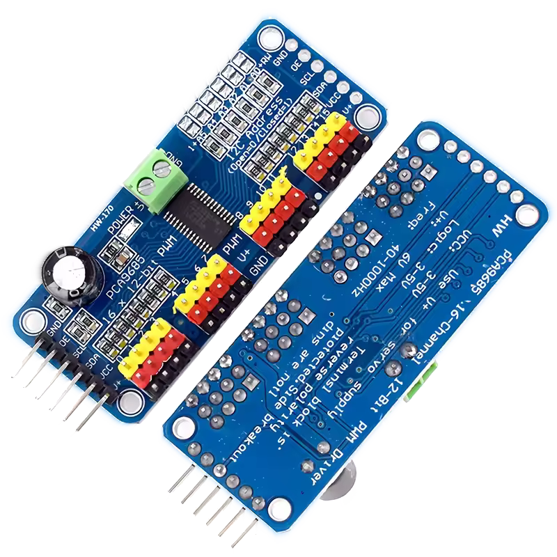

# Proto Board Touch-Sensor Controller

## AT42QT2120

Touch Sensor QTouch [AT42QT2120](https://www.microchip.com/en-us/product/at42qt2120): [view pdf datasheet online](https://ww1.microchip.com/downloads/en/DeviceDoc/doc9634.pdf)

AT42QT2120 is a 10-channel capacitive touch sensor controller with I2C interface.

It is designed for applications such as buttons, sliders, and wheels.

AT42QT2120-SU = 20 pin 0.300 inch wide body SOIC package

[Hole for Backlighting LED - page 13](https://ww1.microchip.com/downloads/aemDocuments/documents/OTH/ApplicationNotes/ApplicationNotes/Atmel-42094-QTouch-Schematic-and-Layout-Checklist_ApplicationNote_AT02259.pdf), see "Figure 3-2. Hole for Backlighting LED"

Example for [AT42QT_API](https://github.com/SmartTech/AT42QT/blob/master/AT42QT_API/QT2120.h)

## Demo board QT1 XPLAINED PRO EXTENSION KIT

Part Number: [ATQT1-XPRO](https://www.microchip.com/en-us/development-tool/ATQT1-XPRO)

[SAM D20 XPLAINED PRO EVALUATION KIT](https://ww1.microchip.com/downloads/aemDocuments/documents/OTH/ProductDocuments/UserGuides/Atmel-42102-SAMD20-Xplained-Pro_User-Guide.pdf) 
Part Number: [ATSAMD20-XPRO](https://www.microchip.com/en-us/development-tool/ATSAMD20-XPRO)

## SMD LED reverse mount

SML-822MV8WT86
LED, Rouge, Vert jaune, CMS - Montage inversé, Rectangulaire, R 20mA, YG 20mA
https://fr.farnell.com/rohm/sml-822mv8wt86/led-rouge-jaune-vert-30-25mcd/dp/2908898 ***
https://fscdn.rohm.com/en/products/databook/datasheet/opto/led/chip_multi/sml-822mv8wt86-e.pdf
https://www.rohm.com/products/led/chip-leds-multi-color-type/sml-822mv8w-product

LED CMS RVB PLCC à montage inverse
https://www.digikey.fr/fr/product-highlight/s/sunled/reverse-mount-rgb-plcc-smd-led
Référence fabricant : XZMDKCBDDG45S-9

---

## Driver de LED DC/DC

### PCA9635PW,118

LED-Driver-PCA9635

> Code Commande Farnell : [1854073](https://fr.farnell.com/nxp/pca9635pw-118/driver-de-led-rgba-28-tssop/dp/1854073)
> Quantité 1, Prix (TVA incluse) 2,760€
> Driver LED, Bus I2C, Isolé, 16 bits, 1MHz, Sortie 5,5V/25mA, Entrée 2,3V à 5,5V
> https://fr.aliexpress.com/item/33038992925.html
> https://www.nxp.com/docs/en/data-sheet/PCA9635.pdf

[Breakout PCA9685PW module Servomotor Shield on Aliexpress](https://fr.aliexpress.com/item/1005007462728654.html)

<!--  -->

